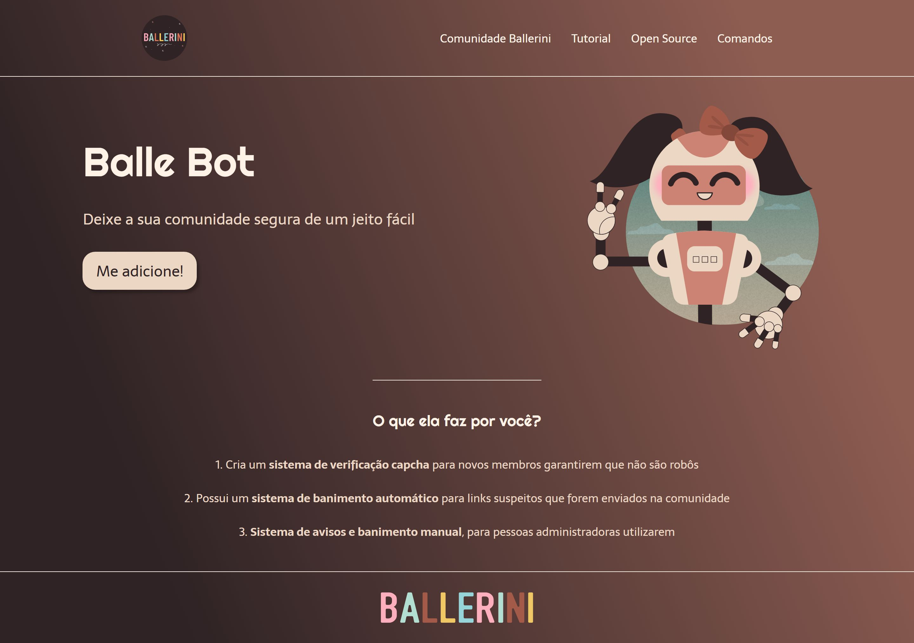

# Landing Page Balle Bot

Projeto de landing page com HTML e CSS ministrado por Rafaella Ballerini no YouTube. Temática foi a Balle Bot, bot da comunidade Ballerini no Discord.

  <a href="#-tecnologias">Tecnologias</a>&nbsp;&nbsp;&nbsp;|&nbsp;&nbsp;&nbsp;
  <a href="#-projeto">Projeto</a>

 

  

## 🚀 Tecnologias

Esse projeto foi desenvolvido com as seguintes tecnologias:

- HTML5
- CSS3 com conceitos de Flexbox
- Git e Github
- Figma

## 💻 Projeto

Objetivo do projeto foi aprimorar e revisar meus conhecimentos em HTML5 e CSS3.Landing page desenvolvida com base na aula ministrada por Rafaella Ballerini, no Youtube.

- [Acesse o conteúdo da aula aqui](https://www.youtube.com/watch?v=llF6vD-RljE)